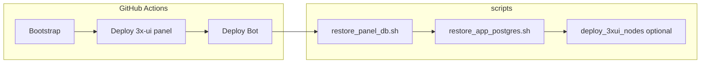

# Восстановление после сноса (панель + Postgres бота)

Два независимых хранилища; для полного восстановления нужны **оба бэкапа** с **одного момента времени** (или готовность перевыдать ключи).

| Бэкап | Содержимое | Путь на master после деплоя |
|--------|------------|-----------------------------|
| **Панель 3x-ui** | SQLite: inbounds, клиенты Xray, ноды в UI | `/opt/infrastructure/panel/db/x-ui.db` |
| **Postgres бота** | users, subscriptions, `panel_inbound_id`, зашифрованные ключи | том Docker `app_postgres_data` |

Секреты GitHub / `.env` должны совпадать с моментом бэкапа, особенно **`ENCRYPTION_KEY`**, **`NODE_IPS`**, **`DOMAIN_NAME`**, **`VPN_ADMIN_*`**, **`TELEGRAM_*`**. Список имён: [`GITHUB_SECRETS.md`](GITHUB_SECRETS.md).

См. также: [`BACKUP.md`](BACKUP.md) (ежедневная отправка в Telegram), [`DEPLOY_BOT.md`](DEPLOY_BOT.md), [`PANEL_MASTER_NODES.md`](PANEL_MASTER_NODES.md), [`PANEL_REST_API.md`](PANEL_REST_API.md) (`importDB`, `getDb`).

---

## Скрипты в репозитории

| Скрипт | Назначение |
|--------|------------|
| [`scripts/restore_from_backups.sh`](../scripts/restore_from_backups.sh) | Оба бэкапа подряд (панель → Postgres) |
| [`scripts/restore_panel_db.sh`](../scripts/restore_panel_db.sh) | Только SQLite панели |
| [`scripts/restore_app_postgres.sh`](../scripts/restore_app_postgres.sh) | Только Postgres (`.sql` или `.dump`) |
| [`scripts/restore-panel-db-remote.sh`](../scripts/restore-panel-db-remote.sh) | Выполняется **на master** (обычно через ssh) |
| [`scripts/restore-app-postgres-remote.sh`](../scripts/restore-app-postgres-remote.sh) | То же для Postgres |
| [`scripts/lib/restore-common.sh`](../scripts/lib/restore-common.sh) | Общие функции (не запускать напрямую) |

Запуск с **WSL/Linux** из корня репозитория. В `.env`: **`MASTER_IP`**, **`SSH_PRIVATE_KEY`** (как для [`deploy_bot.sh`](../scripts/deploy_bot.sh)).

```bash
# полное восстановление (после шагов CI ниже)
bash scripts/restore_from_backups.sh ./backups/x-ui.db ./backups/app.sql

# с повторной регистрацией нод
bash scripts/restore_from_backups.sh --deploy-nodes ./backups/x-ui.db ./backups/app.dump
```

Отдельно:

```bash
bash scripts/restore_panel_db.sh ./backups/x-ui.db
bash scripts/restore_app_postgres.sh ./backups/app.sql
bash scripts/restore_app_postgres.sh --format custom ./backups/app.dump
```

На **master** без scp (файл уже на сервере):

```bash
bash scripts/restore_panel_db.sh --on-master /tmp/x-ui.db
bash scripts/restore_app_postgres.sh --on-master /tmp/app.sql
```

---

## Порядок: GitHub Actions + скрипты

После **полного сноса** master сначала поднимите **пустой** каркас, затем залейте бэкапы.

### 1. Секреты

**Settings → Secrets and variables → Actions** — все секреты из [`GITHUB_SECRETS.md`](GITHUB_SECRETS.md), в т.ч. **`ENCRYPTION_KEY`** и **`NODE_IPS`** как до инцидента.

### 2. Workflows (Actions → Run workflow)

| # | Workflow | Параметр |
|---|----------|----------|
| 1 | **Bootstrap Infrastructure** | — |
| 2 | **Deploy 3x-ui** | **target: `panel`** |
| 3 | **Deploy Bot** | — |

Дождитесь зелёного статуса у всех трёх.

### 3. Восстановление БД (локально)

```bash
bash scripts/restore_from_backups.sh /path/to/x-ui.db /path/to/app.sql
```

### 4. Ноды

| Ситуация | Действие |
|----------|----------|
| VPS нод **не** переустанавливали | **Deploy 3x-ui** → **target: `nodes`** или `bash scripts/deploy_3xui_nodes.sh` |
| Ноды тоже снесены | То же после bootstrap нод; бэкап master **не** восстанавливает Xray на нодах |

Флаг `--deploy-nodes` у `restore_from_backups.sh` вызывает `deploy_3xui_nodes.sh` (нужен **`NODE_IPS`** в `.env`).

### 5. Проверка

```bash
bash scripts/check-bot-stack-remote.sh   # через ssh из deploy_bot или вручную на master
```

- Панель: inbounds, **Nodes → Online**
- Telegram: «Мои ключи», тестовая выдача
- На master (опционально):

```bash
cd /opt/infrastructure/app
docker compose exec -T postgres psql -U postgres -d app -c \
  "SELECT panel_inbound_id, count(*) FROM subscriptions GROUP BY 1;"
```

Id inbound из Postgres должны существовать в UI панели.

---

## Альтернатива: импорт панели через UI

После **Deploy 3x-ui (panel)** можно не копировать файл вручную:

1. Войти в панель → **Settings → Backup/Restore**
2. Загрузить тот же `.db`, что в бэкапе

Эквивалент API `POST /panel/api/server/importDB` ([`PANEL_REST_API.md`](PANEL_REST_API.md)). Затем всё равно **`restore_app_postgres.sh`** для базы бота.

---

## Создание бэкапов (на будущее)

**Панель** — на master:

```bash
cd /opt/infrastructure/panel
docker compose stop x-ui
cp db/x-ui.db /tmp/x-ui.db.$(date +%Y%m%d)
docker compose start x-ui
# скачать: scp root@MASTER:/tmp/x-ui.db.YYYYMMDD ./
```

Или API `GET /panel/api/server/getDb`, или Telegram-бэкап панели (`tgBotBackup` в Ansible).

**Postgres бота** — на master:

```bash
cd /opt/infrastructure/app
docker compose exec -T postgres pg_dump -U postgres -Fc app > /tmp/app.dump
# или SQL:
docker compose exec -T postgres pg_dump -U postgres app > /tmp/app.sql
```

Храните оба файла **с одной меткой времени**.

---

## Частые проблемы

| Симптом | Причина / решение |
|---------|-------------------|
| Ключи в боте не открываются | Другой **`ENCRYPTION_KEY`** — нужен ключ с момента бэкапа Postgres |
| Бот не находит клиента в панели | Бэкапы **разного времени** — восстановить пару с одной даты или перевыдать `vless://` |
| `FAIL: нет каталога /opt/infrastructure/panel` | Не выполнен **Deploy 3x-ui (panel)** |
| `FAIL: нет каталога /opt/infrastructure/app` | Не выполнен **Deploy Bot** |
| Ноды **Offline** | **Deploy 3x-ui → nodes** ([`PANEL_MASTER_NODES.md`](PANEL_MASTER_NODES.md#нода-в-ui-показывает-offline)) |
| `pg_restore` ошибки «already exists» | Повторить restore: скрипт делает `DROP SCHEMA public CASCADE` перед импортом |

---

## Схема



**Не меняйте порядок:** Postgres восстанавливайте **после** первого Deploy Bot (нужен контейнер `postgres`). Панель — **после** Deploy panel (нужен каталог `panel/db/`).
